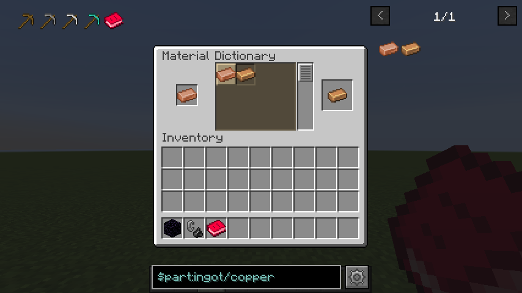

# HT Materials: Robustum Edition

This is a simple Minecraft mod for **Fabric+1.16.5** that provides _**Material System**_ and _**Part Tag Format**_

## Material System

The Material System was invented to handle Tags more generally by decomposing them into `HTMaterial` and `HTShape`.  
`HTMaterial` represents the material of objects: _Iron_, _Gold_, _Copper_, _Stone_, _Wood_, ...  
`HTShape` represents the shape of objects: _Ingot_, _Nugget_, _Plate_, _Gear_, _Rod_, ...

## Part Tag

Many Fabric mods follows `Conventional Tag` format such as `c:copper_ingots`. This mod **automatically** replaces these
tags into _Part
Tag Format_ by _Material System_. For example, `c:copper_ingots` will be converted into `part:ingot/copper`. You don't
need to replace existing tags in json files or internal codes!

## Fluid Unification

HT Materials can sync not only tags but also fluids! After the flattening, fluid became vanilla feature and has been
managed with Identifier: namespace and path. This destructive change divided fluid with same name and different
namespace. Based on the Material System, there fluids are linked to Conventional Tags.

## How to create Addon

1. Add new entrypoint `ht_materials` in `fabric.mod.json`
2. Implement [io.github.hiiragi283.api.HTMaterialsAddon](src/api/kotlin/io/github/hiiragi283/api/HTMaterialsAddon.kt)

### Example

- [fabric.mod.json](src/main/resources/fabric.mod.json)
- [HTTestAddon](src/main/java/io/github/hiiragi283/material/HTTestAddon.java)

## API

- Accessible HT-Materials' API via [HTMaterialsAPI.INSTANCE](src/api/kotlin/io/github/hiiragi283/api/HTMaterialsAPI.kt)